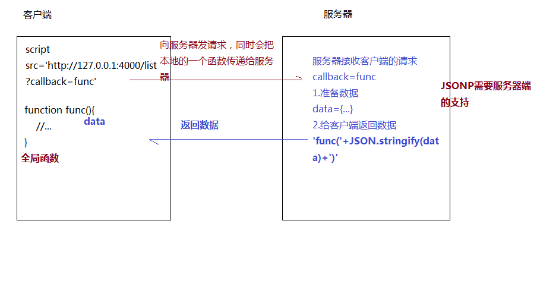

# 跨域

## 一、什么是跨域

1. **定义**

   浏览器从一个域名的网页去请求另一个域名的资源时，**域名、端口、协议**任一不同，都是跨域。
   

2. **产生的原因**

   当浏览器的 tab 打开两个不同的网站页面，浏览器的 1tab 执行脚本时候会检查找个脚本属于哪个页面，检查域名/端口/协议是否一致，如果同源则执行，如果非一致，则会在控制台抛出异常。这也得益于浏览器同源策略对用户安全信息的保护，防止用户 Cookie 信息泄露。

3. **同源策略**

   同源策略（Same origin policy）是一种约定，它是浏览器最核心的也是最基本的安全功能，web 也是构建在同源策略基础上，浏览器只是针对同源策略的一种实现。它是由 Netscape 提出的一个著名的安全策略，目前支持 JavaScript 的浏览器都会使用找个策略。

4) **同源策略限制内容**
   > - cookie、localStorage 和 indexDB 无法读取
   > - DOM 无法获得
   > - AJAX 请求不能发送
5) **常见跨域场景**  
   当**协议、子域名、主域名、端口号中任意一个不相同时**，都算作不同域。不同域之间相互请求资源，就算作“跨域”。常见跨域场景如下图所示：
   
6) **注意**
   > - 如果是协议和端口造成的跨域问题“前台”是无能为力的。
   > - 在跨域问题上，仅仅是通过“URL 的首部”来识别而不会根据域名对应的 IP 地址是否相同来判断。“URL 的首部”可以理解为“协议, 域名和端口必须匹配”。
   > - 跨域并不是请求发不出去，请求能发出去，服务端能收到请求并正常返回结果，只是结果**被浏览器拦截了**。你可能会疑问明明通过表单的方式可以发起跨域请求，为什么 Ajax 就不会?因为归根结底，跨域是为了阻止用户读取到另一个域名下的内容，Ajax 可以获取响应，浏览器认为这不安全，所以拦截了响应。但是表单并不会获取新的内容，所以可以发起跨域请求。同时也说明了跨域并不能完全阻止 CSRF，因为请求毕竟是发出去了。

---

## 二、跨域解决方案

### 1. jsonp

1. JSONP 原理
   **利用 \<script\> 标签没有跨域限制的漏洞，网页可以得到从其他来源动态产生的 JSON 数据。JSONP 请求一定需要对方的服务器做支持才可以。**
   <br/>
2. JSONP 和 AJAX 对比
   JSONP 和 AJAX 相同，都是客户端向服务器端发送请求，从服务器端获取数据的方式。但 AJAX 属于同源策略，JSONP 属于非同源策略（跨域请求）  
   <br/>
3. JSONP 优缺点
   - JSONP 优点是简单兼容性好，可用于解决主流浏览器的跨域数据访问的问题。
   - 缺点是**仅支持 get 方法具有局限性,不安全可能会遭受 XSS 攻击**
     <br/>
4. 实现
   
   - 声明一个回调函数，其函数名(如 show)当做参数值，要传递给跨域请求数据的服务器，函数形参为要获取目标数据(服务器返回的 data)。
   - 创建一个\<script>标签，把那个跨域的 API 数据接口地址，赋值给 script 的 src,还要在这个地址中向服务器传递该函数名（可以通过问号传参:?callback=show）。
   - 服务器接收到请求后，需要进行特殊的处理：把传递进来的函数名和它需要给你的数据拼接成一个字符串。
   - 最后服务器把准备的数据通过 HTTP 协议返回给客户端，客户端再调用执行之前声明的回调函数（show），对返回的数据进行操作。
5. 代码  
   启动服务`yarn serve-jsonp`
   **(1)原生**
   封装成 jsonp 函数

```javascript
// jsonp.js
function jsonp({ url, params, callback }) {
  return new Promise((resolve, reject) => {
    let script = document.createElement('script');
    window[callback] = function(data) {
      resolve(data);
      document.body.removeChild(script);
    };
    params = { ...params, callback };
    let arrs = [];
    for (let key in params) {
      arrs.push(`${key}=${params[key]}`);
    }
    script.src = `${url}?${arrs.join('&')}`;
    console.log(script.src);
    document.body.appendChild(script);
  });
}
```

```javascript
// jsonp.html//
<button onclick="getData()">json</button>

<script>
function getData(){
jsonp({
  url:'http://localhost:3000/get/testjsonp',
  params: { wd: '跨域成功' },
  callback:'show'
}).then(res=>{
  console.log(JSON.stringify(res))
})
}
</script>
```

**(2)jquery**

```javascript
//jsonp-jq.html
<button onclick="getData()">jsonp-jq</button>

<script>
function getData() {
  $.ajax({
    url: 'http://localhost:3000/get/testjsonp',
    type: 'get',
    dataType: "jsonp",
    data: {
      "wd": "跨域成功"
    },
    jsonp: "callback",
    success: function (res) {
      console.log(res)
    },
    error: function () {
      console.log('跨域失败')
    }
  })
}
</script>
```

### 2. cors

**CORS 需要浏览器和后端同时支持。IE 8 和 9 需要通过 XDomainRequest 来实现。**

- 浏览器会自动进行 CORS 通信，实现 CORS 通信的关键是后端。只要后端实现了 CORS，就实现了跨域。
- 服务端设置 Access-Control-Allow-Origin 就可以开启 CORS。 该属性表示哪些域名可以访问资源，如果设置通配符则表示所有网站都可以访问资源。
- 虽然设置 CORS 和前端没什么关系，但是通过这种方式解决跨域问题的话，会在发送请求时出现两种情况，分别为**简单请求**和**复杂请求**。

1. 简单请求&复杂请求

- 简单请求
  只要同时满足以下两大条件，就属于简单请求
  条件 1：使用下列方法之一：

  - GET
  - HEAD
  - POST

  条件 2：Content-Type 的值仅限于下列三者之一：

  - text/plain
  - multipart/form-data
  - application/x-www-form-urlencoded

- 复杂请求  
  不符合以上条件的请求就是复杂请求了。 复杂请求的 CORS 请求，会在正式通信之前，增加一次 HTTP 查询请求，称为"预检"请求,该请求是 option 方法的，通过该请求来知道服务端是否允许跨域请求。

2. 代码
   启动服务`yarn serve-cors` 1.服务端代码

   ```javascript
   // 中间件cors.js
   const CORS_CONFIG = require('../config/cors_config');
   module.exports = function(options) {
     //options处理

     return async (ctx, next) => {
       //逻辑
       const {
         ALLOW_ORIGIN,
         CREDENTIALS,
         HEADERS,
         ALLOW_METHODS
       } = CORS_CONFIG.CROS;
       ctx.set('Access-Control-Allow-Origin', ALLOW_ORIGIN);
       ctx.set('Access-Control-Allow-Credentials', CREDENTIALS);
       ctx.set('Access-Control-Allow-Headers', HEADERS);
       ctx.set('Access-Control-Allow-Methods', ALLOW_METHODS);
       if (ctx.method == 'OPTIONS') {
         ctx.body = 200;
       } else {
         await next();
       }
     };
   };
   ```

   ```javascript
   // cors配置文件cors_config.js
   module.exports = {
     //=>WEB服务端口号
     PORT: 3000,

     //=>CROS跨域相关信息
     CROS: {
       ALLOW_ORIGIN: 'http://localhost:8080',
       ALLOW_METHODS: 'PUT,POST,GET,DELETE,OPTIONS,HEAD',
       HEADERS:
         'Content-Type,Content-Length,Authorization, Accept,X-Requested-With',
       CREDENTIALS: true
     },

     //=>SESSION存储相关信息
     SESSION: {
       secret: 'ZFPX',
       saveUninitialized: false,
       resave: false,
       cookie: {
         maxAge: 1000 * 60 * 60 * 24 * 30
       }
     }
   };
   ```

   2. 前端代码

   ```javascript
   //cors.html
       <button onclick="getData()">cors-get</button>
       <button onclick="getDataP()">cors-post</button>
     <script>
        function getData() {
      axios
        .get('http://localhost:3000/get/testGet')
        .then(s => {
          console.log(s);
        })
        .catch(f => {
          console.log(f);
        });
    }
    function getDataP(){
      axios
      .post('http://localhost:3000/post/testPost')
      .then(s => {
      console.log(s);
      })
      .catch(f => {
      console.log(f);
      });
    }
     </script>
   ```

### 3. proxy+webpack
- client 端启动`yarn serve-proxy`
- 服务端启动`yarn serve-none`

原理与node在后台配置中间件一致

```javascript
// 配置文件proxy.config.js
 devServer: {
    port: 8081,
    // progress: true,
    contentBase: './build',
    proxy: {
      '/': {
        target: 'http://127.0.0.1:3000',
        changeOrigin: true
      },
      '/other': {
        target: 'http://127.0.0.1:30000',
        changeOrigin: true,
        pathRewrite: {
          '^/other':'/'
        }
      }
    }
  },
```

```javascript
// proxy.js
import axios from 'axios';
const btnGet = document.querySelector('.buttonGet');
const btnPost = document.querySelector('.buttonPost');
const btnOther = document.querySelector('.buttonOther');

function getData() {
  axios
    .get('/get/testGet')
    .then(s => {
      console.log(s);
    })
    .catch(f => {
      console.log(f);
    });
}
function getDataP() {
  axios
    .post('/post/testPost')
    .then(s => {
      console.log(s);
    })
    .catch(f => {
      console.log(f);
    });
}
function getDataO() {
  axios
    .get('/other/get/testGet')
    .then(s => {
      console.log(s);
    })
    .catch(f => {
      console.log(f);
    });
}
btnGet.addEventListener('click', getData);
btnPost.addEventListener('click', getDataP);
btnOther.addEventListener('click', getDataO);
```

```javascript
// proxy.html
<button class="buttonGet">proxy-get</button>
<button class="buttonPost">proxy-post</button>
<button class="buttonOther">proxy-other</button>
```

### 4. proxy+middleware

**服务端启动服务:**

- `yarn serve-none`
- `yarn serve-none2`
- `yarn serve-proxy`
 
 实现原理：同源策略是浏览器需要遵循的标准，而如果是服务器向服务器请求就无需遵循同源策略。 代理服务器，需要做以下几个步骤：  
  - 接受客户端请求。
  - 将请求 转发给服务器。
  - 拿到服务器 响应 数据。
  - 将 响应 转发给客户端。
  

1. 服务端代码
   使用了中间件 koa-server-http-proxy

```javascript
// serve.proxy.js
//实例化koa和中间件
const Koa = require('koa');
const bodyParser = require('koa-bodyparser');
const Router = require('koa-router');
const proxy = require('koa-server-http-proxy');
const cors = require('../middleware/cors');

const app = new Koa();
const router = new Router();

//使用中间件
app.use(cors());
app.use(bodyParser());
app.use(router.routes()).use(router.allowedMethods());

const proxyTable = {
  '/get1': {
    target: 'http://127.0.0.1:3000',
    pathRewrite: { '^/get1': '' },
    changeOrigin: true
  },
  '/get2': {
    target: 'http://127.0.0.1:30000',
    pathRewrite: { '^/get2': '' },
    changeOrigin: true
  }
};

Object.keys(proxyTable).forEach(context => {
  var options = proxyTable[context];
  app.use(proxy(context, options));
});

//配置端口
const port = process.env.PORT || 4000;
app.listen(port, () => {
  console.log('server on');
});
```

2. client 代码

```javascript
  //proxy.html
  <button onclick="getData1()">proxy-middleware1</button>
  <button onclick="getData2()">proxy-middleware2</button>
  <script>
    function getData1() {
      axios
        .get('http://127.0.0.1:4000/get1/get/testGet')
        .then(s => {
          console.log(s);
        })
        .catch(f => {
          console.log(f);
        });
    }
    function getData2() {
      axios
        .get('http://127.0.0.1:4000/get2/get/testGet')
        .then(s => {
          console.log(s);
        })
        .catch(f => {
          console.log(f);
        });
    }
  </script>
```

### 5. nginx
- 实现原理类似于Node中间件代理，需要你搭建一个中转nginx服务器，用于转发请求。  
- 使用nginx反向代理实现跨域，是最简单的跨域   方式。只需要修改nginx的配置即可解决跨域问   题，支持所有浏览器，支持session，不需要修   改任何代码，并且不会影响服务器性能。
- 实现思路：通过nginx配置一个代理服务器（域   名与domain1相同，端口不同）做跳板机，反向   代理访问domain2接口，并且可以顺便修改      cookie中domain信息，方便当前域cookie写    入，实现跨域登录。
```javascript
// proxy服务器
   server {
       listen       81;
       server_name  www.domain1.com;
       location / {
           proxy_pass   http://www.domain2.com:8080;  #反向代理
           proxy_cookie_domain www.domain2.com www.domain1.com; #修改cookie里域名
           index  index.html index.htm;

           # 当用webpack-dev-server等中间件代理接口访问nignx时，此时无浏览器参与，故没有同源限制，下面的跨域配置可不启用
           add_header Access-Control-Allow-Origin http://www.domain1.com;  #当前端只跨域不带cookie时，可为*
           add_header Access-Control-Allow-Credentials true;
       }
}

```
```javascript
// index.html
var xhr = new XMLHttpRequest();
// 前端开关：浏览器是否读写cookie
xhr.withCredentials = true;
// 访问nginx中的代理服务器
xhr.open('get', 'http://www.domain1.com:81/?user=admin', true);
xhr.send();

```
```javascript
// server.js
var http = require('http');
var server = http.createServer();
var qs = require('querystring');
server.on('request', function(req, res) {
    var params = qs.parse(req.url.substring(2));
    // 向前台写cookie
    res.writeHead(200, {
        'Set-Cookie': 'l=a123456;Path=/;Domain=www.domain2.com;HttpOnly'   // HttpOnly:脚本无法读取
    });
    res.write(JSON.stringify(params));
    res.end();
});
server.listen('8080');
console.log('Server is running at port 8080...');

```


### 6. websocket

服务端运行`yanr serve-websocket`
Websocket是HTML5的一个持久化的协议，它实现了浏览器与服务器的全双工通信，同时也是跨域的一种解决方案。WebSocket和HTTP都是应用层协议，都基于 TCP 协议。**但是 WebSocket 是一种双向通信协议，在建立连接之后，WebSocket 的 server 与 client 都能主动向对方发送或接收数据。**同时，WebSocket 在建立连接时需要借助 HTTP 协议，连接建立好了之后 client 与 server 之间的双向通信就与 HTTP 无关了。  

我使用了ws和socket.io来进行通信,二者都封装了原生WebSocket API,二者区别较大，请自行搜索

服务器端

```javascript
// serve.websocket.js
const WebSocket = require('ws');

const socket = new WebSocket.Server({ port: 8080 });
socket.on('connection', ws => {
  ws.on('message', data => {
    console.log(data);
    ws.send('给客户端发的消息');
  });
});
```

client 端

```javascript
// websocket.html
<script>
  // Create WebSocket connection
  const socket = new WebSocket('ws://localhost:8080');

  // Connection opened
  socket.addEventListener('open', function (event) {
    socket.send('给服务端发送的消息');
  });

  // Listen for messages
  socket.addEventListener('message', function (event) {
    console.log('Message from server ', event.data);
  });
</script>
```

### 7. postMessage

- client 启动`yarn postMessage-father`,`yarn postMessage-son`
 
postMessage是HTML5 XMLHttpRequest Level 2中的API，且是为数不多可以跨域操作的window属性之一，它可用于解决以下方面的问题：
- 页面和其打开的新窗口的数据传递
- 多窗口之间消息传递
- 页面与嵌套的iframe消息传递
- 上面三个场景的跨域数据传递
**postMessage()方法允许来自不同源的脚本采用异步方式进行有限的通信，可以实现跨文本档、多窗口、跨域消息传递。**
`otherWindow.postMessage(message, targetOrigin, [transfer]);`
- message: 将要发送到其他 window的数据。
- targetOrigin:通过窗口的origin属性来指定哪些窗口能接收到消息事件，其值可以是字符串"*"（表示无限制）或者一个URI。在发送消息的时候，如果目标窗口的协议、主机地址或端口这三者的任意一项不匹配targetOrigin提供的值，那么消息就不会被发送；只有三者完全匹配，消息才会被发送。
- transfer(可选)：是一串和message 同时传递的 Transferable 对象. 这些对象的所有权将被转移给消息的接收方，而发送一方将不再保有所有权。

```javascript
//father.html
<div>来自son的回信：</div>
  <div class="comesFromSon"></div>
  <iframe src="http://localhost:1002/son.html" frameborder="1px" id="frame" onload="send()"></iframe>
  <script>
    function send(){
       const frame = document.getElementById('frame')
       const comesFromSon=document.querySelector('.comesFromSon')
       frame.contentWindow.postMessage('给son的消息', 'http://localhost:1002')
       window.onmessage = function (e) {
        //  console.log('father:'+e.data)
       comesFromSon.innerHTML=e.data
       }
    }
  </script>
```

```javascript
//son.html
  <div>来自father的消息：</div>
<div class="comesFromFather"></div>
<script>
    window.onmessage = function (e) {
      // console.log('son:'+e.data)
      e.source.postMessage('给father的信息', e.origin);
    const comesFromFather=document.querySelector('.comesFromFather')
    comesFromFather.innerHTML=e.data
  };
</script>
```

### 8. document.domain+iframe

1. **该方式只能用于二级域名相同的情况下**，比如 a.test.com 和 b.test.com 适用于该方式。 只需要给页面添加 document.domain ='test.com' 表示二级域名都相同就可以实现跨域。
2. 实现原理：  
   两个页面都通过js强制设置document.domain为基础主域，就实现了同域。
```javascript
//a.html
<body>
 helloa
 <iframe src="http://b.zao.cn:3000/b.html" frameborder="0" onload="load()" id="frame"></iframe>
 <script>
   document.domain = 'zao.cn'

   function load() {
     console.log(frame.contentWindow.a);
   }
 </script>
</body>
```

```javascript
// b.html
<body>
  hellob
  <script>document.domain = 'zao.cn' var a = 100;</script>
</body>
```

### 9. window.name+iframe

- client 启动`yarn window-name-ab`,`yarn window-name-c`

1. window.name属性的独特之处：name值在不同的页面（甚至不同域名）加载后依旧存在，并且可以支持非常长的 name 值（2MB）。
2. 通过iframe的src属性由外域转向本地域，跨域数据即由iframe的window.name从外域传递到本地域。这个就巧妙地绕过了浏览器的跨域访问限制，但同时它又是安全操作。

```javascript
    <iframe src="http://localhost:4000/c.html" frameborder="0" onload="load()" id="iframe"></iframe>
  <script>
    let first = true
    // onload事件会触发2次，第1次加载跨域页，并留存数据于window.name
    function load() {
      if (first) {
        // 第1次onload(跨域页)成功后，切换到同域代理页面
        let iframe = document.getElementById('iframe');
        iframe.src = 'http://localhost:8080/b.html';
        first = false;
      } else {
        // 第2次onload(同域b.html页)成功后，读取同域window.name中数据
        console.log(iframe.contentWindow.name);
      }
    }
  </script>
```

```javascript
// b.html
<script>window.name = 'bbbb'</script>
```

```javascript
// c.html
<body>c</body>
```

### 10. location.hash+iframe

- client 启动`yarn location-hash-ab`,`yarn location-hash-c`

1. 实现原理:  
   a.html欲与c.html跨域相互通信，通过中间页b.html来实现。 三个页面，不同域之间利用iframe的location.hash传值，相同域之间直接js访问来通信。
2. 具体流程
   一开始a.html给c.html传一个hash值，然后c.html收到hash值后，再把hash值传递给b.html，最后b.html将结果放到a.html的hash值中。 同样的，a.html和b.html是同域的

```javascript
// a.html
 <iframe src="http://localhost:4000/c.html#a send to c"></iframe>
<script>
 window.onhashchange = function () { //检测hash的变化
   console.log(location.hash);
 }
</script>
```

```javascript
// b.html
<script>
  window.parent.parent.location.hash = location.hash
  //b.html将结果放到a.html的hash值中，b.html可通过parent.parent访问a.html页面
</script>
```

```javascript
// c.html
<script>
  console.log(location.hash); let iframe = document.createElement('iframe');
  iframe.src = 'http://localhost:8080/b.html#c send to a';
  document.body.appendChild(iframe);
</script>
```
